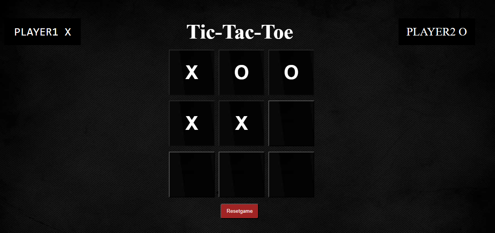

# 🎮 Tic Tac Toe Game

A classic **Tic Tac Toe game** using **HTML, CSS, and JavaScript** with two-player mode, winner detection, and reset functionality.

---

## 🌐 Live Demo
Check the project live here: [TIC-TAC-TOE](https://awaistabaruk.github.io/tic-tac-toe/)

---

## 📸 Screenshots
  

---

## 🛠 Features
- Two-player gameplay (Player X & Player O)  
- Dynamic winner detection (rows, columns, diagonals)  
- Reset button to restart the game
- Responsive Design

---

## ⚙️ Tech Stack
- **HTML5** – Structure  
- **CSS3** – Styling  
- **JavaScript (ES6)** – Game logic  

---

---

## 🎯 How to Play
1. Open the game in your browser.  
2. Player X starts first, followed by Player O.  
3. The game automatically detects the winner.  
4. Use the **Reset** button to start a new game.  

---

## 📌 Future Improvements
- Add **single-player mode** with AI (minimax algorithm)  
- Add **scoreboard** to track wins  
- Add **dark/light mode**  

---

## 👨‍💻 Author
**AWAIS TABARUK**  
[GitHub Profile]( https://github.com/Awaistabaruk) | [LinkedIn](https://www.linkedin.com/in/awais-tabaruk-6a0b31327)

---

⭐ If you like this project, don’t forget to **star the repository**!
